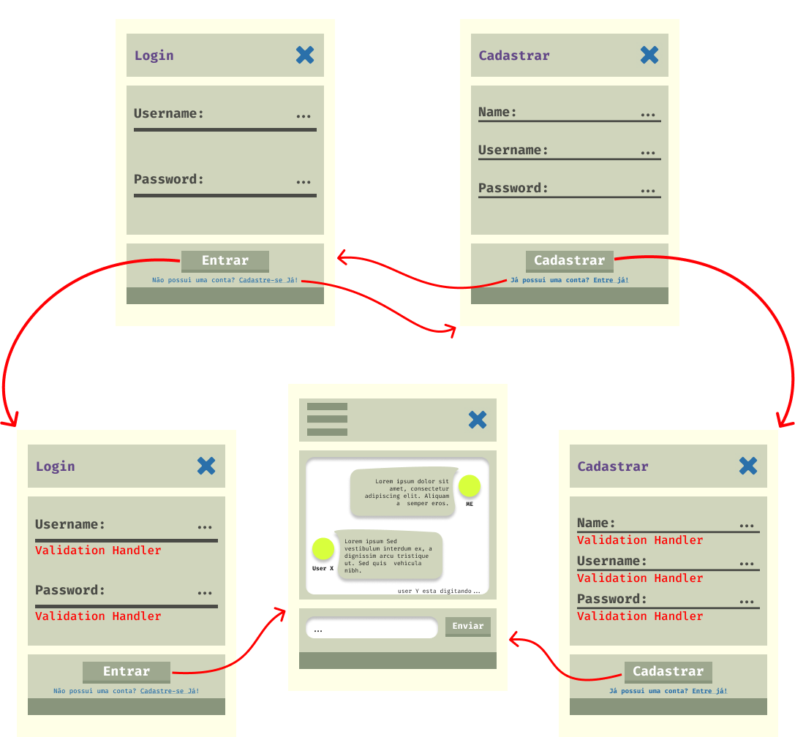

Leonardo Luz & Diego Prestes <br/>
4º Semestre ADS <br/>
[Repositório](https://github.com/leonardo-luz/social-media-app-college-project)

---
## Sumário	
1. [Descrição](#Descrição)
2. [Configuração](#Configuração)
3. [Objetivos](#Objetivos)
	1. [Primários](#Primários)
	2. [Secundários](#Secundários)
4. [Tecnologias](#Tecnologias)
	1. [Frontend](#Frontend)
	2. [Backend](#Backend)
5. [Model banco de dados](#ModeloBancodedados)
	1. [Relacional](#Relacional)
	2. [Lógico](#Lógico)
6. [Prototipação](#Prototipação)
7. [Considerações Finais](#ConsideraçõesFinais)

---
### Descrição
>Este projeto terá como objetivo principal desenvolver uma Rede social focada em interação em tempo real entre usuários apartir de um chat global, existindo também a opção de conversar em particular com amigos adicionados.

---
### Configuração

```
git clone https://github.com/leonardo-luz/social-media-app-college-project
cd your_path/social-media-app-college-project

mvn clean install

mvn javafx:run
```

---
### Objetivos

##### - Primários:
- [ ] Chat global
- [ ] Autenticação de usuário
- [ ] Lista de usuário online
- [ ] Perfil do usuário

##### - Secundários:
- [ ] Adicionar amigos
- [ ] Lista de amigos online e offline
- [ ] Chat privado 
- [ ] Grupo privado
- [ ] Grupo publico
- [ ] Adicionar foto ao perfil
- [ ] Bloquear usuário
- [ ] Enviar images por mensagem

---

### Tecnologias

- Java JDK 21

#### - Frontend:
- JavaFx 21
	- Utilizado para a implementação de interface gráfica.

#### - Backend:
- WebSocket
	- Utilizado para a implementação do chat em tempo real.

---
### Modelo Banco de Dados

```
User(userId, name, username, password, createdAt, updatedAt)
```

```
User_Friend(userId, friendId, createdAt, updatedAt)
	userId Referencia User
	friendId Referencia User
```

```
User_Block(userId, blockId, createdAt, updatedAt)
	userId Referencia User
	blockId Referencia User
```

```
Chat(chatId, title, adminId, createdAt, updatedAt)
	adminId Referencia User
```

```
Chat_User(Chat_User_Id, chatId, userId, createdAt, updatedAt)
	chatId Referencia Chat
	userId Referencia User
```

```
Message(messageId, text, userId, chatId, createdAt, updatedAt)
	userId Referencia User
	chatId Referencia Chat
```

#### Relacional


#### Lógico


---
### Prototipação [WIP]



---

### Considerações Finais
> Dado a extensão do projeto, provavelmente não será possivel implementar todas as funcionabilidades secundárias previstas até o prazo final.
