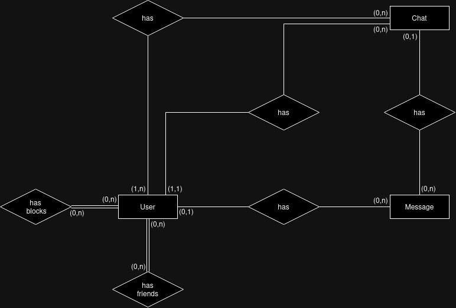
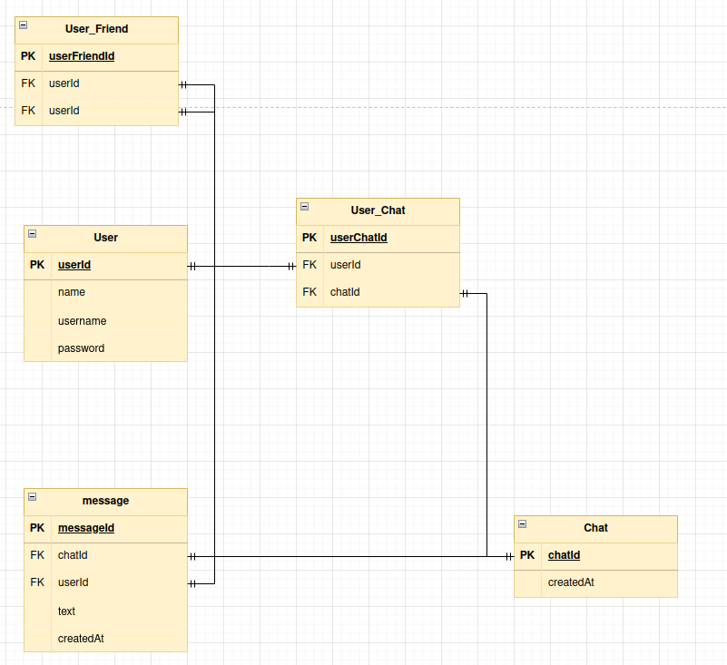
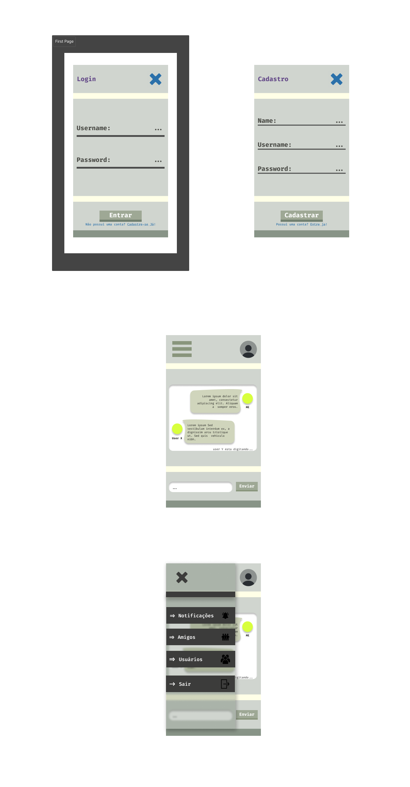

Leonardo Luz & Diego Prestes <br/>
4º Semestre ADS <br/>
[Repositório](https://github.com/leonardo-luz/social-media-app-college-project)

---
## Sumário	
1. [Descrição](#Descrição)
2. [Configuração](#Configuração)
	1. [Banco de dados](#Banco-de-dados)
	2. [Aplicação](#Aplicação)
	3. [Variáveis de ambiente](#Variáveis-de-ambiente)
3. [Objetivos](#Objetivos)
	1. [Primários](#Primários)
	2. [Secundários](#Secundários)
4. [Tecnologias](#Tecnologias)
	1. [Frontend](#Frontend)
	2. [Backend](#Backend)
5. [Model banco de dados](#Modelo-Banco-de-dados)
	1. [Relacional](#Relacional)
	2. [Lógico](#Lógico)
6. [Prototipação](#Prototipação)
7. [Considerações Finais](#Considerações-Finais)

---
### Descrição
>Este projeto terá como objetivo principal desenvolver uma Rede social focada em interação em tempo real entre usuários apartir de um chat global, existindo também a opção de conversar em particular com amigos adicionados.

---
### Configuração

##### Banco de dados

```
CREATE DATABASE projeto;
```

```
CREATE TABLE Users(
    usersId SERIAL NOT NULL,
    name VARCHAR(100) NOT NULL,
    username VARCHAR(16) NOT NULL UNIQUE,
    password VARCHAR(16) NOT NULL,
    createdAt DATE DEFAULT(NOW()),
    updatedAt DATE DEFAULT(NOW()),
    CONSTRAINT pk_users PRIMARY KEY (usersId),
    CONSTRAINT unique_username UNIQUE (username)
);

CREATE TABLE Users_Friend(
    usersId INT NOT NULL, 
    friendId INT NOT NULL, 
    createdAt DATE DEFAULT(NOW()), 
    updatedAt DATE DEFAULT(NOW()),
    CONSTRAINT pk_users_friend PRIMARY KEY (usersId, friendId),
    CONSTRAINT fk_users_friend FOREIGN KEY (usersId) REFERENCES users (usersId)
        ON DELETE CASCADE
        ON UPDATE CASCADE,
    CONSTRAINT fk_friend_users FOREIGN KEY (friendId) REFERENCES users (usersId)
        ON DELETE CASCADE
        ON UPDATE CASCADE
);

CREATE TABLE Users_Block(
    usersId INT NOT NULL, 
    blockId INT NOT NULL, 
    createdAt DATE DEFAULT(NOW()), 
    updatedAt DATE DEFAULT(NOW()),
    CONSTRAINT pk_users_block PRIMARY KEY (usersId, blockId),
    CONSTRAINT fk_users_block FOREIGN KEY (usersId) REFERENCES users (usersId)
        ON DELETE CASCADE
        ON UPDATE CASCADE,
    CONSTRAINT fk_block_users FOREIGN KEY (blockId) REFERENCES users (usersId)
        ON DELETE CASCADE
        ON UPDATE CASCADE
);

CREATE TABLE Chat(
    chatId SERIAL NOT NULL, 
    title VARCHAR(12), 
    adminId INT NOT NULL, 
    createdAt DATE DEFAULT(NOW()), 
    updatedAt DATE DEFAULT(NOW()),
    CONSTRAINT pk_chat PRIMARY KEY (chatId),
    CONSTRAINT fk_chat_admin FOREIGN KEY (adminId) REFERENCES users (usersId)
        ON DELETE CASCADE
        ON UPDATE CASCADE
);

CREATE TABLE Chat_Users(
    chatId INT NOT NULL,
    usersId INT NOT NULL, 
    createdAt DATE DEFAULT(NOW()), 
    updatedAt DATE DEFAULT(NOW()),
    CONSTRAINT pk_chat_users PRIMARY KEY (chatId, usersId),
    CONSTRAINT fk_chat_users FOREIGN KEY (chatId) REFERENCES chat (chatId)
        ON DELETE CASCADE
        ON UPDATE CASCADE,
    CONSTRAINT fk_users_chat FOREIGN KEY (usersId) REFERENCES users (usersId)
        ON DELETE CASCADE
        ON UPDATE CASCADE
);

CREATE TABLE Message(
    messageId SERIAL NOT NULL, 
    text TEXT NOT NULL,
    usersId INT,
    chatId INT,
    createdAt DATE DEFAULT(NOW()), 
    updatedAt DATE DEFAULT(NOW()),
    CONSTRAINT pk_message PRIMARY KEY (messageId),
    CONSTRAINT fk_message_users FOREIGN KEY (usersId) REFERENCES users (usersId)
        ON DELETE SET NULL
        ON UPDATE CASCADE,
    CONSTRAINT fk_message_chat FOREIGN KEY (chatId) REFERENCES chat (chatId)
        ON DELETE SET NULL
        ON UPDATE CASCADE
);
```

```
INSERT INTO users (
    name, 
    username, 
    password
)
VALUES(
    'admin', 
    'admin', 
    'admin'
),
(
    'José Almeida', 
    'robert', 
    'carlos'
),
(
    'blocked users',
    'blocked',
    'users'
),
(
    'friend users',
    'friend',
    'users'
);
```

```
INSERT INTO Users_Block(
    usersid,
    blockId
)
VALUES(
    1,
    2
);
```

```
INSERT INTO Users_Friend(
    usersid,
    friendId
)
VALUES(
    1,
    3
);
```

```
INSERT INTO chat(
    title, 
    adminid
)
VALUES(
    'global', 
    1
);
```

```
INSERT INTO Chat_Users(
    chatid,
    usersId
)
VALUES(
    1,
    1
),
(
    1,
    2
);
```

```
INSERT INTO message(
    text, 
    usersid, 
    chatid
) 
VALUES(
    'Lorem ipsum dolor sit amet, consectetur adipiscing elit. Integer nec mauris non orci porttitor laoreet. Vestibulum feugiat purus eu nunc malesuada dignissim.', 
    1, 
    1
);
```

##### Aplicação
```
git clone https://github.com/leonardo-luz/social-media-app-college-project
cd your_path/social-media-app-college-project

mvn clean install

mvn javafx:run
```

##### Variáveis de ambiente
```
cd your_path/social-media-app-college-project
touch .env
```

```
POSTGRES_URL = jdbc:postgresql://YOUR_PG_HOST:YOUR_PG_PORT/YOUR_PG_DATABASE
POSTGRES_USER = YOUR_PG_USERNAME
POSTGRES_PASSWORD = YOUR_PG_PASSWORD
```

---
### Objetivos

##### - Primários:
- [ ] Chat global
- [ ] Autenticação de usuário
- [ ] Lista de usuário online
- [ ] Perfil do usuário

##### - Secundários:
- [ ] Adicionar amigos
- [ ] Lista de amigos online e offline
- [ ] Chat privado 
- [ ] Grupo privado
- [ ] Grupo publico
- [ ] Adicionar foto ao perfil
- [ ] Bloquear usuário
- [ ] Enviar images por mensagem

---

### Tecnologias

- Java JDK 21

#### - Frontend:
- JavaFx 21
	- Utilizado para a implementação de interface gráfica.

#### - Backend:
- WebSocket
	- Utilizado para a implementação do chat em tempo real.

---
### Modelo Banco de Dados

```
User(userId, name, username, password, createdAt, updatedAt)
```

```
User_Friend(userId, friendId, createdAt, updatedAt)
	userId Referencia User
	friendId Referencia User
```

```
User_Block(userId, blockId, createdAt, updatedAt)
	userId Referencia User
	blockId Referencia User
```

```
Chat(chatId, title, adminId, createdAt, updatedAt)
	adminId Referencia User
```

```
Chat_User(Chat_User_Id, chatId, userId, createdAt, updatedAt)
	chatId Referencia Chat
	userId Referencia User
```

```
Message(messageId, text, userId, chatId, createdAt, updatedAt)
	userId Referencia User
	chatId Referencia Chat
```

#### Relacional



#### Lógico


---
### Prototipação [WIP]



---

### Considerações Finais
> Dado a extensão do projeto, provavelmente não será possivel implementar todas as funcionabilidades secundárias previstas até o prazo final.
