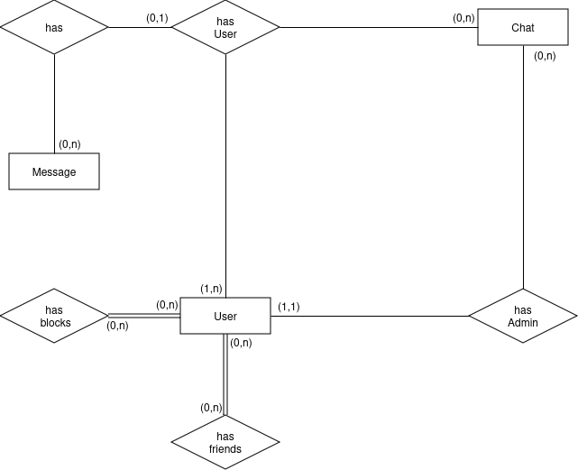

Leonardo Luz & Diego Prestes <br/>
4º Semestre ADS <br/>
[Repositório](https://github.com/leonardo-luz/social-media-app-college-project)

# Projeto Final de Programação Orientada a Objetos 2

## Sumário
1. [Descrição](#Descrição)
2. [Configuração](#Configuração)
	1. [Requisitos](#Requisitos)
	2. [Banco de dados](#Esquema-Banco-de-dados)
	3. [Clone o Repositório](#Clone-o-Repositório)
	4. [Variáveis de ambiente](#Variáveis-de-ambiente)
	5. [Compile e Execute](#Compile-e-Execute)
3. [Tecnologias](#Tecnologias)
	1. [Frontend](#Frontend)
	2. [Backend](#Backend)
4. [Model banco de dados](#Modelo-Banco-de-dados)
	1. [Relacional](#Relacional)
	2. [Lógico](#Lógico)
5. [Prototipação](#Prototipação)

---
### Descrição
> O objetivo deste projeto é desenvolver uma rede social voltada para a interação em tempo real entre usuários, com um chat global como principal funcionalidade. Além disso, será possível realizar conversas privadas entre usuários

---
### Configuração

##### Requisitos
1. Java JDK
2. Postgres
3. Maven

##### Esquema do Banco de dados

[](./src/main/java/ifrs/edu/com/config/SCHEMA.md)

##### Clone o Repositório
```
git clone https://github.com/leonardo-luz/social-media-app-college-project
cd your_path/social-media-app-college-project
```

##### Variáveis de ambiente
```
cd your_path/social-media-app-college-project
touch .env
```

```
POSTGRES_URL = jdbc:postgresql://YOUR_PG_HOST:YOUR_PG_PORT/YOUR_PG_DATABASE
POSTGRES_USER = YOUR_PG_USERNAME
POSTGRES_PASSWORD = YOUR_PG_PASSWORD

WS_URI = ws://YOUR_WS_HOST:YOUR_WS_PORT
```


##### Compile e Execute
```
mvn clean install

mvn javafx:run
```

---
### Tecnologias

1. Java JDK 21
2. Dotenv
        - Utilizado para armazenar variáveis de ambiente

#### - Frontend:
1. JavaFx 21
	- Utilizado para a implementação de interface gráfica.

#### - Backend:
1. WebSocket
	- Utilizado para a implementação do chat em tempo real.

---
### Modelo Banco de Dados

```
User(userId, name, username, password, createdAt, updatedAt)
```

```
User_Friend(userId, friendId, createdAt, updatedAt)
	userId Referencia User
	friendId Referencia User
```

```
User_Block(userId, blockId, createdAt, updatedAt)
	userId Referencia User
	blockId Referencia User
```

```
Chat(chatId, title, adminId, createdAt, updatedAt)
	adminId Referencia User
```

```
Chat_User(Chat_User_Id, chatId, userId, createdAt, updatedAt)
	chatId Referencia Chat
	userId Referencia User
```

```
Message(messageId, text, userId, chatId, createdAt, updatedAt)
	userId Referencia User
	chatId Referencia Chat
```

#### Conceitual



#### Lógico


---
### Prototipação


